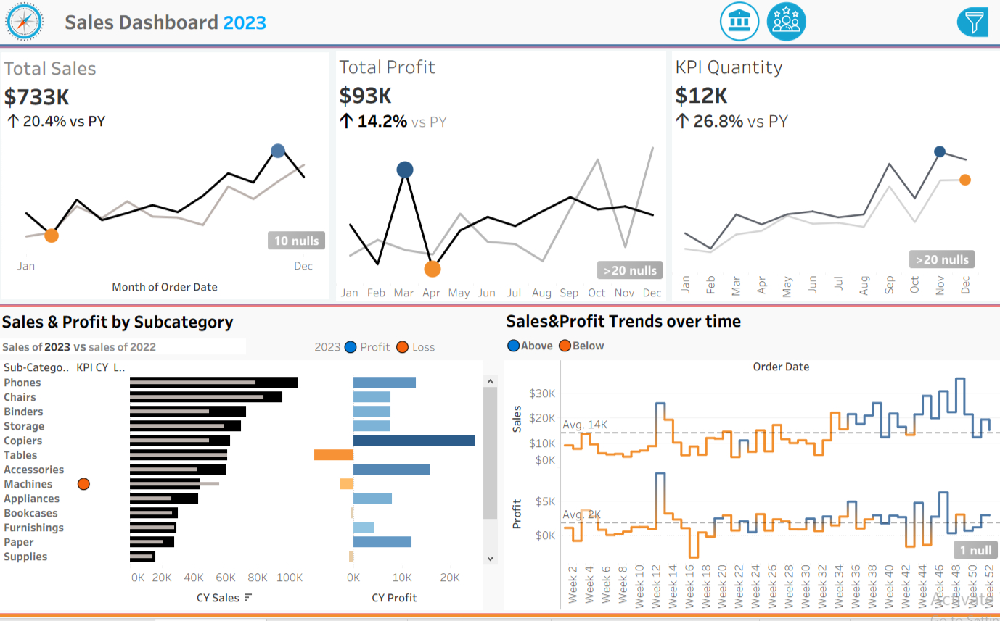
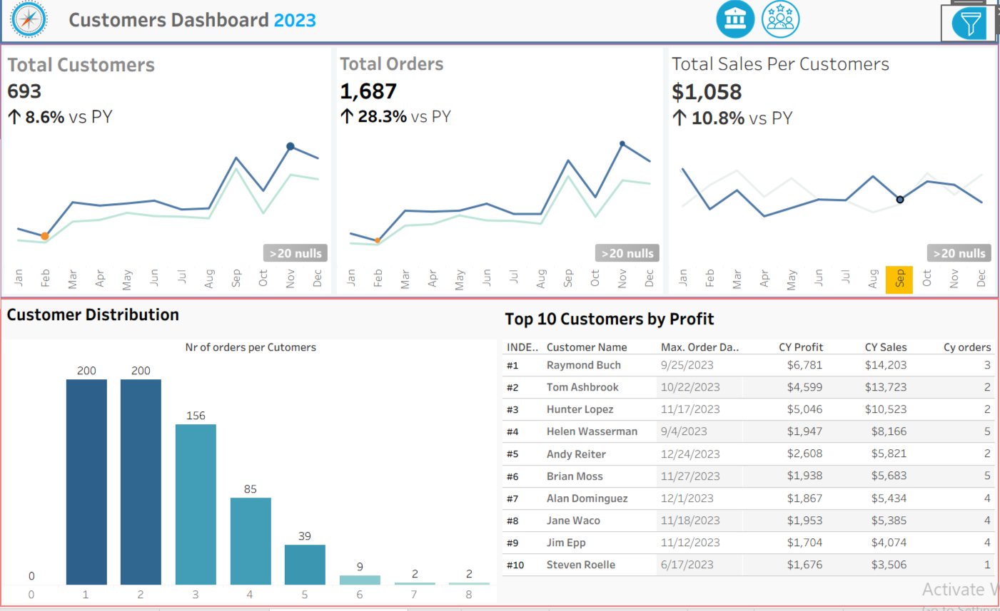

# Sales & Customers Dashboard — Tableau

Interactive Tableau dashboard suite analyzing sales performance and customer behavior using the Superstore dataset. Built with a KPI-first layout, year-over-year trend sparklines, and drill-down views by subcategory and customer.

## Overview

The workbook contains two linked dashboards:

- **Sales Dashboard** — tracks total sales, profit, and quantity KPIs against prior year, with a breakdown by product subcategory and a weekly sales/profit trend view.
- **Customers Dashboard** — tracks customer count, order volume, and average sales per customer, with an order-frequency distribution and a top-10 customers-by-profit leaderboard.

## Dashboards

### 📊 Sales Dashboard
- **Total Sales**: $733K (+20.4% vs PY)
- **Total Profit**: $93K (+14.2% vs PY)
- **KPI Quantity**: $12K (+26.8% vs PY)
- Sales & Profit by Subcategory (2023 vs 2022)
- Weekly Sales & Profit trends with above/below-average coloring

### 👥 Customers Dashboard
- **Total Customers**: 693 (+8.6% vs PY)
- **Total Orders**: 1,687 (+28.3% vs PY)
- **Total Sales Per Customer**: $1,058 (+10.8% vs PY)
- Customer Distribution by number of orders
- Top 10 Customers by Profit

## Tableau Techniques Used

-  **Calculated Fields** — e.g. YoY % change, Profit Ratio, Above/Below Average flag
-  **Parameters** — e.g. KPI/metric selector, Top N control
-  **Table Calculations** — e.g. % of Total, Running Total, Moving Average
-  **Dashboard Actions** — Filter / Highlight / URL actions linking charts and views
-  **Sets & Groups** — e.g. Top 10 Customers set, subcategory grouping
-  **Dynamic Zone Visibility** — showing/hiding containers based on selection
-  **Sheet Swap technique** — switching between Sales and Customers views
- **Dual-Axis / Reference Lines** — average lines on the weekly trend charts

## Tech Stack

- **Tableau Desktop / Tableau Public** — dashboard design and calculations
- **Dataset**: Superstore (Sales, Profit, Orders, Customers)

## Files

| File | Description |
|---|---|
| `sales-customers-dashboard.twbx` | Packaged Tableau workbook containing both dashboards |
| `img/` | Dashboard preview images |

## How to View

1. Download [Tableau Public Desktop](https://public.tableau.com/en-us/s/download) (free) or open in Tableau Desktop.
2. Open `sales-customers-dashboard.twbx`.
3. Use the dashboard tabs at the bottom to switch between **Sales** and **Customers** views.

Or view the published version directly on Tableau Public: [tanzila.gasimova](https://public.tableau.com/app/profile/tanzile.gasimova)

## Key Insights

- Sales and order volume grew steadily through the year, accelerating in Q4.
- Storage and Bookcases deliver disproportionately high profit relative to sales, while Copiers and Accessories run at a loss.
- A small group of repeat customers (3+ orders) drives a large share of total profit.

## License

This project is for portfolio/educational purposes. Superstore is a publicly available sample dataset commonly used for BI training.
